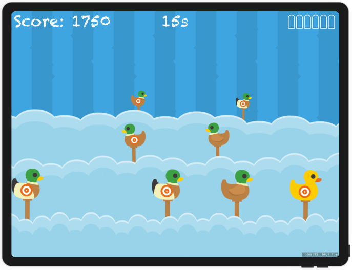
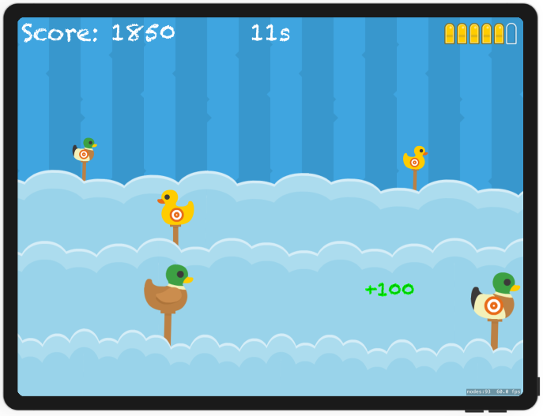
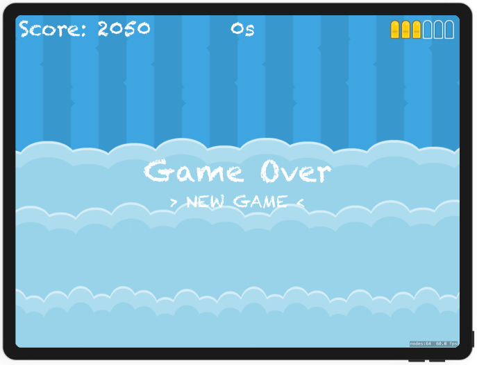

# Milestone Projects 16-18

https://www.hackingwithswift.com/100/66

Game assets under [CC0 License](https://creativecommons.org/publicdomain/zero/1.0/legalcode) thanks to [Kenney](https://kenney.nl/assets/shooting-gallery), and under [CC-BY-SA License](https://creativecommons.org/licenses/by-sa/4.0/legalcode) thanks to [1001.com](https://opengameart.org/content/shooting-gallery-pack)

Game sounds under [CC Attribution license](https://creativecommons.org/licenses/by/3.0/legalcode) thanks to [TheNikonProductions](https://freesound.org/people/TheNikonProductions/sounds/337697/), [bone666138](https://freesound.org/people/bone666138/sounds/198841/), and under [CC0 License](https://creativecommons.org/publicdomain/zero/1.0/legalcode) thanks to [RoLL1n](https://freesound.org/people/RoLL1n/sounds/387848/), [nioczkus](https://freesound.org/people/nioczkus/sounds/396331/)

## Challenge

>It’s time to put your skills to the test and make your own app, starting from a blank canvas. This time your challenge is to make a shooting gallery game using SpriteKit: create three rows on the screen, then have targets slide across from one side to the other. If the user taps a target, make it fade out and award them points.
>
>How you implement this game really depends on what kind of shooting gallery games you’ve played in the past, but here are some suggestions to get you started:
>
>- Make some targets big and slow, and others small and fast. The small targets should be worth more points.
>- Add “bad” targets – things that cost the user points if they get shot accidentally.
>- Make the top and bottom rows move left to right, but the middle row move right to left.
>- Add a timer that ticks down from 60 seconds. When it hits zero, show a Game Over message.
>- Try going to https://openclipart.org/ to see what free artwork you can find.
>- Give the user six bullets per clip. Make them tap a different part of the screen to reload.
>
>Those are just suggestions – it’s your game, so do what you like!
>
>Tip: I made a SpriteKit shooting gallery game in my book Hacking with macOS – the SpriteKit code for that project is compatible with iOS, but rather than just reading my code you might prefer to just take my assets and use them to build your own project.
>
>As always, please try to code the challenge yourself before reading any of the hints below.
>
>- Moving the targets in your shooting gallery is a perfect job for the moveBy() action. Use a sequence so that targets move across the screen smoothly, then remove themselves when they are off screen.
>- You can create a timer using an SKLabelNode, a secondsRemaining integer, and a Timer that takes 1 away from secondsRemaining every 1 second.
>- Make sure you call invalidate() when the time runs out.
>- Use nodes(at:) to see what was tapped. If you don’t find a node named “Target” in the returned array, you could subtract points for the player missing a shot.
>- You should be able to use a property observer for both player score and number of bullets remaining in clip. Changing the score or bullets would update the appropriate SKLabelNode on the screen.

## Screenshots

